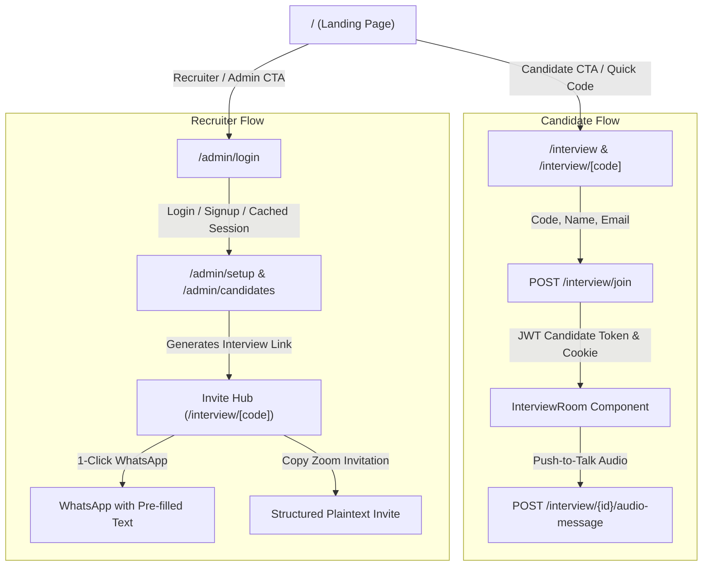

# Landing Page, Candidate Access Portal & Shareable Recruiter Invites

## Overview
This architectural update modernizes the front door of Conlatus. The root route (`/`) has been transformed from an unauthenticated raw interview room into a high-end, responsive landing page offering clear role segregation between **Candidates** and **Recruiters**. A dedicated **Candidate Portal** (`/interview` and `/interview/[code]`) now handles access code verification, onboarding details, and seamless voice session initialization. In addition, the **Admin Console** has been upgraded with Zoom-style invitation formatting and one-click WhatsApp sharing.

---

## Architectural Changes



---

## Key Features & Components

### 1. Root Landing Page (`frontend/src/app/page.tsx`)
- **Brand Hero & Value Proposition**: Prominently showcases Conlatus as an autonomous AI technical interviewer featuring voice push-to-talk, dynamic question generation, and multidimensional rubric scoring.
- **Role Selection Bento**:
  - **Candidate Card**: Directly invites candidates with an inline "Quick Code" entry form and CTA button leading to `/interview`.
  - **Recruiter Card**: Directs hiring managers and administrators to `/admin/login` or directly to `/admin` if an authenticated session is detected.
- **High-End Aesthetics**: Built using obsidian dark mode (`#050505`), specular interactive containers (`SpecularContainer`), smooth micro-animations (`framer-motion`), and responsive bento grids.

### 2. Candidate Portal (`frontend/src/app/interview/page.tsx` & `[code]/page.tsx`)
- **Dedicated Access Point**: Accessible via `/interview` (with manual code entry) or `/interview/<code>` (with pre-filled code from URL).
- **Live Metadata Resolution**: Debounces calls to `GET /interview/details/{code}` to retrieve and preview the Role Title, Company Name, and Scheduled Duration before the candidate starts.
- **Candidate Onboarding**: Gathers candidate's Full Name and Email Address.
- **Authentication & Token Exchange**: Sends `POST /interview/join` to issue an `interview_session` JWT token and set the `auth_token` browser cookie.

### 3. Modular Voice Interview Room (`frontend/src/components/interview/InterviewRoom.tsx`)
- **Extracted & Reusable**: Completely modularized out of the root page into an isolated component.
- **WebRTC Camera Preview**: Live candidate camera feed with camera toggle and fallback placeholder.
- **Push-to-Talk & Audio Recording**: MediaRecorder integration capturing audio blobs and dispatching them to Groq Whisper v3 (`/interview/{sessionId}/audio-message`).
- **Text Fallback**: Embedded input allowing candidates to type answers if preferred.
- **Browser Speech Synthesis**: Real-time TTS reading out interview questions dynamically.
- **Authorization Headers**: Ensures all API requests (`/interview/start`, audio messages, text turns) carry `Authorization: Bearer <token>` to prevent 401 Unauthorized errors.

### 4. Admin Invite Sharing (WhatsApp & Zoom-Style Invitations)
- **Direct Candidate URLs**: Formats candidate links as `${origin}/interview/${interview_id}` instead of legacy `/?id=...`.
- **Zoom-Style Copy Button**: One-click copying of a formatted plain-text invitation ready to paste into Email, LinkedIn, or Slack.
- **WhatsApp 1-Click Sharing**: Direct link invoking `https://api.whatsapp.com/send?text=...` with the invitation message pre-filled.
- **Candidate List Integration**: In `candidates/page.tsx`, recruiters can copy direct candidate links or share invitations via WhatsApp directly from the candidate table rows.

### 5. Admin Authentication & Session Caching
- **Token Synchronization**: Synchronizes `access_token`, `admin_token`, and the `auth_token` cookie across `AuthContext`, `api.ts`, and `admin/setup`.
- **Remember Me**: Persists recruiter email in `localStorage` for fast re-authentication.
- **Auto-Redirect**: Automatically redirects authenticated recruiters away from `/admin/login` to `/admin/setup` or their requested route.

---

## API Endpoints Added

### `GET /interview/details/{code}`
- **Purpose**: Public metadata resolver for candidates prior to joining.
- **Response**:
  ```json
  {
    "interview_id": "9a78f23c-83b6-4ac4-9cf9-79f9be6d5b03",
    "role_title": "Full Stack Software Engineer",
    "company_name": "Acme Corp",
    "duration_minutes": 30,
    "is_valid": true
  }
  ```

### `POST /interview/join`
- **Purpose**: Authenticates candidate and issues candidate JWT session token.
- **Payload**:
  ```json
  {
    "interview_code": "9a78f23c-83b6-4ac4-9cf9-79f9be6d5b03",
    "candidate_name": "Jane Doe",
    "candidate_email": "jane@example.com"
  }
  ```
- **Response**:
  ```json
  {
    "interview_id": "9a78f23c-83b6-4ac4-9cf9-79f9be6d5b03",
    "access_token": "eyJhbGciOiJIUzI1NiIsIn...",
    "token_type": "bearer",
    "role_title": "Full Stack Software Engineer",
    "company_name": "Acme Corp",
    "duration_minutes": 30,
    "candidate_name": "Jane Doe",
    "candidate_email": "jane@example.com"
  }
  ```
